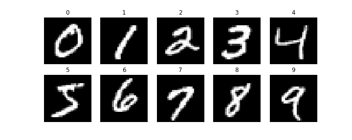

# Red Neuronal Convolucional (CNN) con Keras y PyTorch
Introducción a los algoritmos de aprendizaje profundo y aplicaciones:

* Como siguiente arquitectura se tiene una red neuronal convolucional.
* Se utilizara la base de datos MNIST para reconocer digitos escritos a mano.
* Comparación de implementación Keras vs PyToch.

## MNIST
Ejemplo de imagenes contenidas en la base de datos MNIST:



## Arquitectura de la Red con Keras
```
# Arquitectura de la red
convNN = models.Sequential()
# Agregamos las capas convolucionales
convNN.add(layers.Conv2D(filters     =32, 
                         kernel_size =(3, 3), 
                         activation  ='relu', 
                         input_shape =(28, 28, 1)))
convNN.add(layers.MaxPooling2D(pool_size=(2, 2)))
convNN.add(layers.Conv2D(filters=64, kernel_size=(3, 3), activation='relu'))
convNN.add(layers.MaxPooling2D(pool_size=(2, 2)))
convNN.add(layers.Conv2D(filters=64, kernel_size=(3, 3), activation='relu'))

# Ahora agregamos una red similar con una arquitectura perceptron multicapas
convNN.add(layers.Flatten())
convNN.add(layers.Dense(units=64, activation='relu'))
convNN.add(layers.Dense(units=10, activation='softmax'))
```

## Arquitectura de la Red con PyTorch
```
# Arquitectura de la red
class CNN(nn.Module):
    def __init__(self):
        super(CNN, self).__init__()
        self.conv1 = nn.Conv2d(1, 32, kernel_size=3)
        self.conv2 = nn.Conv2d(32, 64, kernel_size=3)
        self.conv3 = nn.Conv2d(64, 64, kernel_size=3)

        self.fc1 = nn.Linear(64*3*3, 64) # capa oculta 
        self.fc2 = nn.Linear(64, 10) # capa de salida 
        
        self.loss_criterion = nn.CrossEntropyLoss() # Función de pérdida

    def forward(self, x, target):
        x = F.max_pool2d( F.relu(self.conv1(x)), 2)
        x = F.max_pool2d( F.relu(self.conv2(x)), 2)
        x = F.relu(self.conv3(x))
        x = x.view(-1, self.num_flat_features(x)) # flatten
        
        x = F.relu(self.fc1(x)) # Función de activación relu en la salida de la capa oculta
        x = F.softmax(self.fc2(x), dim=1) # Función de activación softmax en la salida de la capa de salida
        
        loss = self.loss_criterion(x, target) # Calculo de la función de pérdida 
        return x, loss
    
    def num_flat_features(self, x):
        size = x.size()[1:]  # all dimensions except the batch dimension
        num_features = 1
        for s in size:
            num_features *= s
        return num_features
```

## Resultados
Para 10 epocas y batch size de 64 obtenemos:

| | Tensorflow-Keras | Pytorch |
| --- | ---         |     ---      |
| acc train | 0.9980 | 0.9916 |
| acc test | 0.9902 | 0.9913 |
| loss train | 0.0074 | 0.022975 |
| loss test | 0.0435 | 0.023077 |
| time | 409.031732 | 815.372076 |


